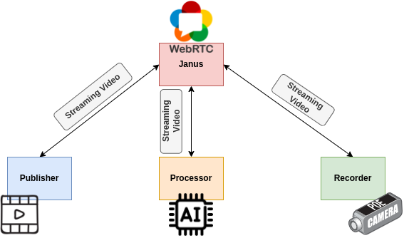

# trytry-webrtc

This repo demonstrates how to use WebRTC to perform real-time AI processing on streaming video. Check the following diagram to know the overall architecture.


## Environment
```
- Linux pc 5.4.0-137-generic #154~18.04.1-Ubuntu SMP Tue Jan 10 16:58:20 UTC 2023 x86_64 x86_64 x86_64 GNU/Linux
- ffmpeg 4.3.2
- Python 3.7 (Important for using aiortc)
```

## Setup Environment
- Install Janus webrtc server
```bash
./install.sh
```
- Upgrade ffmpeg & libavcodec-dev
```bash
# Issue: https://github.com/jdgalviss/jetbot-ros2/issues/6#issuecomment-932993554
sudo add-apt-repository ppa:jonathonf/ffmpeg-4
sudo apt update
sudo apt upgrade -y ffmpeg
sudo apt upgrade -y libavcodec-dev
```
- Install Python packages
```bash
python3 -m pip install -r requirements.txt
```

## How to run
1. Start the janus webrtc server
```bash
/opt/janus/bin/janus
```
2. WebRTC media publisher (Stream the webcam video to the janus webrtc server)
```bash
python3 publisher.py \
    --url http://localhost:8088/janus \
    --room 1234 \
    --name raw \
    --dev /dev/video0
```
3. WebRTC media processor (Fetch the raw streaming video on the janus server and perform AI processing. Then stream the processed video to the janus webrtc server)
```bash
python3 processor.py \
    --url http://localhost:8088/janus \
    --room 1234 \
    --name facedet
```
4. WebRTC media recorder (Record the streaming videos into mpeg4 files on the janus server)
```bash
python3 recorder.py \
    --url http://localhost:8088/janus \
    --room 1234
```

## Replay the recorded videos
```bash
ffplay -f lavfi \
"movie='raw.mp4',scale=iw/2:ih[v0];movie='facedet.mp4',scale=iw/2:ih[v1];[v0][v1]hstack"
```

